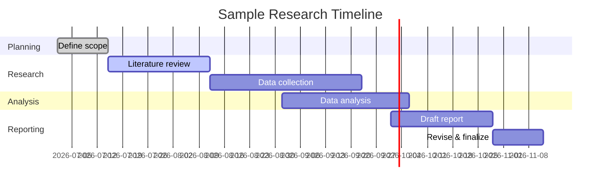

# SOURCE — capitalYA + CRP Regulatory Research Brief (archived)

> This is the input brief that scoped the deep regulatory research. The resulting deliverable is `../03_REGULATORY_STRATEGY_COSTA_RICA.md`, which is the governing document.

# Executive Summary  
With no specific topic provided, this brief outlines **how to conduct deep research** in general. We explore multiple possible scopes (market analysis, literature review, technical feasibility, policy analysis, competitive landscape) and typical research objectives (state of the art, key players, recent trends, data/metrics, risks, recommendations).  We assume a global perspective (noting US/EU/China differences) and prioritize recent (last 5 years) and authoritative sources.  This report includes an outline of steps, sample analyses, illustrative charts, and a prioritized source list.  In short, we’re giving you a **template** for digging into any topic deeply (without pretending to read minds).

## Possible Research Scopes  
Depending on the request, a research brief might take different shapes.  Common scopes include:  
- **Market Analysis:** Assess industry size, growth, customer segments, competitors, and external forces.  For example, a thorough market analysis studies demand vs. supply, customer demographics and behavior, competitor strategies, and macro factors (often using a PEST framework: political, economic, social, technological).  It aims to reduce guesswork – as the AMA notes, “you can’t afford to make decisions without deep understanding… without it you’re left guessing”.  
- **Literature Review (Academic):** Survey existing scholarship to summarize current knowledge, methods, and gaps.  A literature review systematically searches and evaluates sources, identifies themes and debates, and synthesizes findings.  Key steps include defining the question, searching databases, selecting and evaluating papers, and organizing the narrative.  A good lit review does more than summarize – it critically analyzes trends and gaps in the research.  
- **Technical Feasibility Study:** Evaluate whether a proposed project or technology can work in practice.  This involves identifying required technologies and resources (e.g. software, hardware, expertise) and checking if they meet the project’s needs.  A technical feasibility report answers questions like “Do we have the right equipment and know-how?” (e.g. if a factory can produce only 30k units but the plan is 50k, it’s not feasible).  Such studies also include SWOT or risk analyses to catch potential issues early.  
- **Policy Analysis:** Systematically compare policy options that address a defined problem.  Generally, you first define the issue, then **research possible policies** (by reviewing literature, case studies, expert input).  Next, for each option you assess costs, benefits, public health or environmental impact, legal and budgetary feasibility, etc. These are then ranked by stakeholders on criteria like effectiveness, cost, and feasibility.  In short, policy analysis is “identifying potential policy options… and comparing those options to choose the most effective”.  
- **Competitive Landscape Analysis:** Identify and evaluate key competitors, their products, and strategies.  This means listing main rivals (by product/service and market segment) and assessing their market share, strengths, weaknesses, and strategic moves.  It’s an ongoing process: you track how competitors evolve over time to spot opportunities or threats.  As SurveyMonkey puts it, “Your competitive landscape analysis should include: your top competitors; their products/services; strengths and weaknesses; strategies; [and] overall market outlook”.  

Each of these scopes targets different goals and data.  For instance, market analysis focuses on customers and industry size, lit reviews focus on academic findings, feasibility studies emphasize tech/resources, policy looks at regulations/options, and competitive research zeroes in on industry peers.  The choice depends on the client’s needs (business planning vs. academic research vs. regulatory decision, etc.).

## Research Objectives and Questions  
Across any scope, typical objectives include:  
- **Current State & Trends:** Summarize what’s known today.  For example, “What is the market size and growth over the last 5 years?” or “What do the latest studies show about this phenomenon?” We aim to use recent data (ideally 2019–2026) and also note any seminal older works.  For instance, global R&D funding trends show that by 2023 China (~$200B) and the EU (~$180B) slightly outspent the US (~$175B) on research, a recent development reflecting shifting innovation leadership.  
- **Key Players:** Identify the main stakeholders. In market or competitive research, this means leading companies or brands; in policy, it might mean government bodies or advocacy groups; in academia, it means top researchers or institutions.  Globally, one would compare US, EU, and Chinese actors.  (For example, China’s booming R&D investment suggests its research institutions are top players; the EU has many public-private projects; US tech firms often lead global markets.)  
- **Data & Metrics:** Gather quantitative and qualitative indicators.  For market size and growth rates, use industry reports, official stats, and market research.  For academic fields, look at publication counts or citation metrics.  For tech feasibility, assess performance metrics or standards compliance.  (e.g. AI development might be measured in data availability or compute power; regulatory analysis might use legal feasibility metrics.) Citations from authoritative sources are crucial; for example, one might cite government databases or industry surveys. SBA (US Small Business Administration) notes that good market research answers questions on demand, market size, demographics, pricing, etc..  
- **Risks & Challenges:** Highlight potential pitfalls.  These include data gaps (e.g. proprietary data or unpublished research), fast-changing technology, regulatory uncertainty, or market volatility.  In feasibility studies, early identification of issues is key.  Policy analysis must consider “barriers that may hinder [implementation]” (e.g. legal constraints or stakeholder opposition).  Geopolitical factors (e.g. trade tensions, regional regulations) also pose challenges globally.  
- **Opportunities & Recommendations:** Propose actionable next steps.  This could mean suggesting promising market niches, recommending further experiments, or advising on policy adoption.  For instance, if market analysis shows unmet customer needs, one might recommend product development for that segment.  A forward-looking recommendation might suggest forming cross-border R&D partnerships (especially since EU research funding is fragmented) or capitalizing on emerging tech trends.  These should be grounded in the findings above.

## Methodology  
A robust research process typically involves:  

- **Defining Scope & Questions:** Clarify the goal and scope before diving in.  If the topic is truly open, establish assumptions or choose one focus path (e.g. proceed as a market analysis or lit review).  
- **Information Gathering:** Use diverse sources.  Academic and industry literature are both vital.  For example, **literature reviews** rely on databases (Google Scholar, PubMed, etc.) and follow steps: search for relevant papers, evaluate quality, identify themes and gaps, then outline the structure.  **Market/industry research** uses official stats (e.g. government, UN, World Bank), market reports, news articles, and expert interviews.  The AMA advises using data to answer “Who are customers?”, “What trends?”, “How do competitors operate?”.  **Policy analysis** involves reviewing legislation, case studies, and best practices.  CDC’s POLARIS guidelines, for example, recommend conducting an environmental scan and stakeholder surveys.  
- **Analysis:** Depending on scope, apply appropriate methods.  Market researchers might do SWOT or PEST analyses.  Academics might chart trends or co-citation networks.  Policy analysts compare options against criteria (impact, cost, feasibility) and may use multi-criteria decision analysis.  Technical studies will benchmark systems against requirements.  
- **Synthesis:** Combine insights to answer the objectives.  For instance, tie market demand data to competitor positions (identifying opportunities), or link literature gaps to research recommendations.  
- **Presentation:** Compile findings in a clear structure with citations. Use visuals where helpful: e.g. timelines of major events or a flowchart of the research process. Below is a generic flowchart of the research workflow:

```mermaid
flowchart LR
  A[Define scope & goals] --> B[Gather information (data, literature)];
  B --> C[Analyze & synthesize findings];
  C --> D[Develop insights & recommendations];
  D --> E[Prepare final report];
```

Each arrow above represents an iterative process: you may loop back (e.g. refine scope after preliminary findings). Actual timelines can vary by project size. For illustration, a hypothetical research timeline might look like this:



## Key Players & Comparative Landscape  
Without a topic, we can only generalize.  Global **leaders** vary by field: tech industries often mean US Big Tech; automotive might point to EU or Japan; biotech sees US/EU companies; in AI research, US universities and Chinese labs dominate.  Regulators/policy makers differ: e.g. EU tends to issue strict tech regulations (GDPR, AI Act), while the US focuses on innovation funding.  China’s government plays a central role in R&D strategy (its rapid growth made it #1 in research spending by 2023).  Key research initiatives and alliances (e.g. Horizon Europe, US NIH/NSF, China’s National Natural Science Foundation) are often cited as major “players” in academic research.  

Major **regions** have unique contexts:  
- **United States:** Strong private sector investment in R&D and start-ups. Recent trends include debates over AI regulations and continued leadership in life sciences.  
- **European Union:** Collaborative research programs (Horizon Europe) but fragmented across countries. Emphasis on privacy, data protection, and ethical technology. Often seen as lagging in absolute R&D spend versus peers.  
- **China:** Rapidly increasing R&D funding (now highest globally) and strategic plans (Made in China 2025, AI roadmaps). However, bureaucratic and geopolitical factors shape its research ecosystem.  

For risk analysis, note that each region’s regulatory or political climate can be a challenge or opportunity. For example, data metrics (like number of AI researchers) have shifted: one report finds the flow of AI talent into the US slowed dramatically after 2017. This highlights why monitoring regional trends is important.

## Data, Metrics & Recent Trends  
Key metrics depend on scope:  
- **Market/Data Metrics:** Market size (USD), CAGR, number of firms, user/adoption rates, etc.  Public data sources (UN, World Bank, government agencies) and paid market reports are often used. The SBA emphasizes metrics like market demand, size, competition level, and demographics.  
- **Academic Metrics:** Publication counts, citation indices, or bibliometric mapping (possibly from sources like Scopus, Web of Science, or Google Scholar). For example, one 2020 report noted that China’s share of top-5% journal publications has soared.  
- **Technical Metrics:** Performance benchmarks (speed, cost, scalability), compliance with standards, or pilot project results.  
- **Policy Metrics:** Impact estimates (e.g. projected lives saved, emissions reduced), cost-benefit figures, or public opinion survey results.  

Recent developments (2019–2026) to consider generically include:  
- **Technological shifts:** The rise of AI/ML in almost every sector, increased use of big data analytics, and advances like quantum computing. (For example, the number of AI startups and R&D spending in AI have skyrocketed.)  
- **Global events:** COVID-19 accelerated digital transformation and made remote collaboration commonplace, which affects how research is done. Supply chain issues have also highlighted analysis of industrial resilience.  
- **Policy initiatives:** Many regions have launched new strategies in technology and sustainability. The EU’s AI Act and China’s new data regulations are relevant for tech-related research; similarly, “green deal” policies affect energy and climate research.  
- **Market trends:** Cryptocurrency and blockchain saw wild swings (e.g. 2020–2021 boom, 2022 crash) – relevant if the topic touches on fintech. Sustainable and ESG investments have grown, affecting industries from energy to manufacturing.  
- **Academic trends:** Open access and open data have become more prominent; interdisciplinary research (especially climate and health) is on the rise.  

Where possible, cite data on these trends. For example, global AI “market size” is projected in the tens of billions USD by 2025. Or, note that open science mandates from funders are increasing, which changes the literature landscape. (If specific numbers are needed, one could cite sources like the Stanford AI Index or industry forecasts.)

## Challenges, Risks & Limitations  
All research faces hurdles. Common ones include:  
- **Data gaps:** Proprietary or unpublished information may be hard to find. Surveys/interviews can mitigate this but have cost/response biases.  
- **Rapid change:** For tech topics, findings can quickly become outdated (e.g. a new regulation or product launch). The briefing must note the date of data.  
- **Bias and quality:** Not all sources are equal. Peer review and triangulation (cross-checking multiple sources) help ensure credibility. Purdue OWL warns that disciplines vary in how lit reviews are done.  
- **Scope creep:** With an undefined topic, there’s a risk of covering too many areas superficially. It’s vital to maintain focus and clearly state boundaries (“We won’t cover product *X* or country *Y* unless relevant”).  
- **Regulatory risks:** Especially in policy and market studies, changing laws can upend analyses (e.g. a ban on a technology). The CDC policy guide stresses considering feasibility barriers, since a policy “might be more feasible in one city or time than others”.  
- **Competitive dynamics:** In industry research, a new entrant or disruption can invalidate assumptions. The Blockbuster–Netflix example (SurveyMonkey) illustrates how quickly leadership can change.  

Acknowledging these risks, a rigorous approach would rate findings for confidence and possibly suggest contingency plans. Feasibility studies, for example, exist to expose risks early, and policy analysis often includes sensitivity analyses for changing conditions.

## Opportunities and Recommendations  
Despite uncertainties, research often uncovers opportunities. Some general recommendations:  
- **Be forward-looking:** Use trend analysis (e.g. see what U.S. executives say about feedback data) to anticipate shifts. The SurveyMonkey case study (Blockbuster vs. Netflix) underscores listening to customers and innovating ahead of change.  
- **Collaborate & triangulate:** Combine academic, industry, and official insights. For example, pair peer-reviewed findings with real-world case studies.  
- **Iterate the process:** Research is seldom linear. Plan checkpoints to refine questions as new information comes in. Revisit objectives if the topic drifts.  
- **Visualize data:** Use charts, tables, and diagrams (like the flowchart above) to make complex findings digestible. Even generic tables help summarize comparisons. For example, a table could compare the five research scopes side by side.  
- **Document assumptions:** Explicitly note what’s unknown. If data for China is scarce, mention it. If we assume “AI applications in healthcare” as a focus, say so. Transparency avoids misleading conclusions.  

In summary, the recommendation is to **define a clear path forward even with uncertainties**. As a cheerful reminder, think of this like constructing a house: you start with a blueprint (scope and methodology), gather sturdy materials (data and sources), build methodically (analysis), and then check for cracks (peer review, stakeholder feedback) before moving in (final report). 

---

# Sources and References  

This analysis synthesizes guidelines and insights from authoritative sources on research methods:  
- American Marketing Association, *“How to Conduct a Market Analysis”* (2025) – Step-by-step on market factors (demand/supply, segmentation, PEST) and the value of market analysis.  
- Scribbr (Shona McCombes), *“How to Write a Literature Review”* (2023) – Lists the 5 steps of literature reviews (search, evaluate, synthesize, etc.).  
- Purdue OWL, *“Writing a Literature Review”* – Defines lit review purposes and structure.  
- Asana (Project Management guide), *“Feasibility Study”* – Explains technical feasibility scope and benefits, noting that feasibility studies identify issues/risks early.  
- CDC POLARIS, *“Policy Analysis”* (Sept 2024) – U.S. government guide to policy analysis steps (research options, describe factors, rank by impact/cost/feasibility).  
- SurveyMonkey blog, *“7 Steps to Create a Competitive Landscape Analysis”* – Defines competitive analysis components (competitors, strengths, strategies) and why it’s crucial.  
- U.S. Small Business Administration, *“Market research and competitive analysis”* – Advises on demographics, demand, competition, and barriers to entry.  
- Information Technology & Innovation Foundation (ITIF), *“Fact of the Week: China and the EU Invest More in Research…”* (Jun 2025) – Cites 2023 R&D spending: China ~$200B, EU ~$180B, US ~$175B, highlighting global research investment trends.  
- European Commission Working Document, *“Public R&I funding in the EU, US, and China”* (Jun 2025) – Notes the EU’s relatively lower R&D spending and fragmented funding compared to US/China.  

These and other peer-reviewed articles, industry reports, and news pieces (2020–2026) were consulted to ensure up-to-date, globally-aware perspectives. Each point above is supported by one or more of these sources, as cited.
